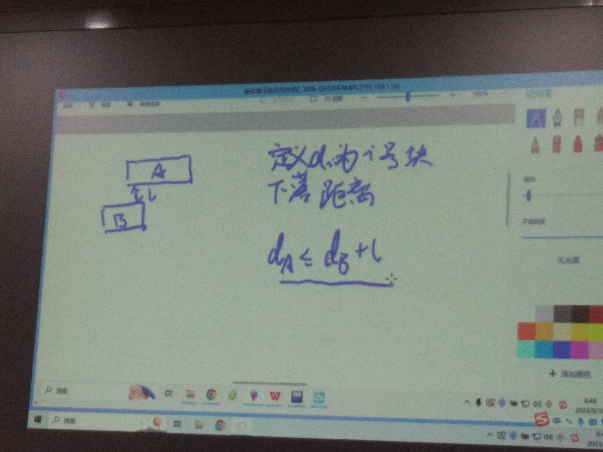
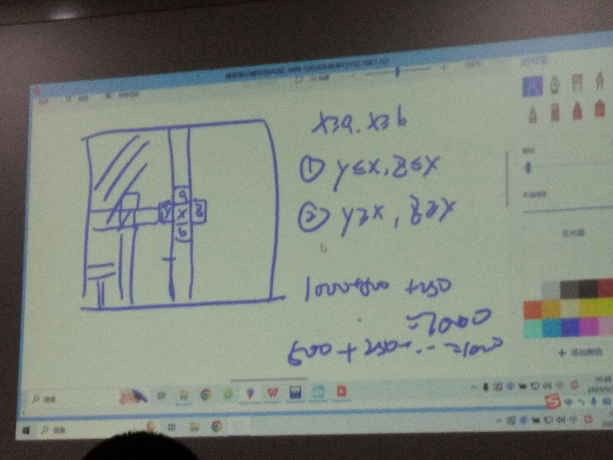
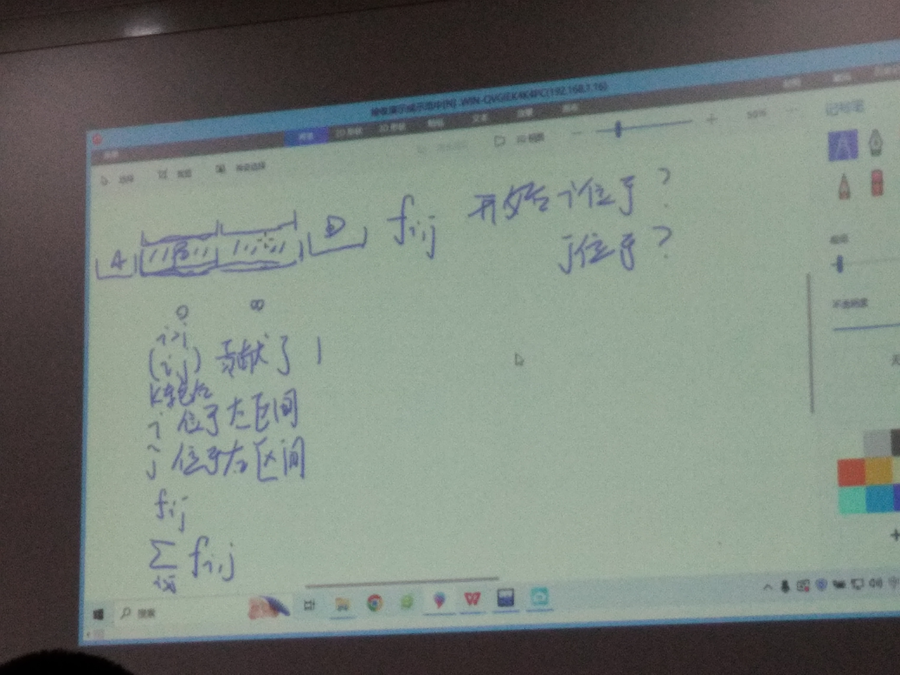

# 第二天
_~~全是数学题~~_  
**小提示：永远不要相信`GitHub Copilot`写的代码 _绝对爆零_**

## 膜拜
黄子宽老师：  
  
王廉达大佬：  


## 上午

### 一、差分约束
#### \# 例题引入
- 题目描述：  
    > 给$n$个变量$x_1, x_2, ..., x_n$，限制$x_i \leqslant x_j + w_ij$且$x_i \leqslant G$，求$max\{x_i\}$
- 示例：
    $$ \left\{
    \begin{aligned}
    x_1\leqslant 3 \\
    x_2\leqslant x_1+5 \\
    x_1\leqslant x_3+1 \\
    x_3\leqslant 1
    \end{aligned}
    \right.
    $$
    解得
    $$ \left\{
    \begin{aligned}
    x_3=1 \\
    x_1=2 \\
    x_2=7
    \end{aligned}
    \right.
    $$
    建图  
    
  
#### \# 解题：[俄罗斯方块 P4184](https://noip.ac/rs/show_problem/4184)
  
$\exists i, \forall j, d_i < d_j + w_{ij}$

### 二、搜索
#### \# 剪枝
- 最先搜索可能性最少的点（可行性剪枝）
- 剩下的数最优情况下也不超过全局最优解则剪枝

#### \# 一道自创题
- 题目描述  
    > 有$q$次询问，每次询问一个数$x$，询问$x$每次除一个约数直到最后变为$1$有多少种方式。  
    比如$x=6, 6 \rightarrow 1, 6 \rightarrow 3 \rightarrow 1, 6 \rightarrow 2 \rightarrow 1$三种  

    > $x \leqslant 1e15, q \leqslant 1e4$
- 题解
    - 先用Pollard-Rho分解质因数
    - 发现 假设我们得到$x=a_1^{p_1}*a_2^{p_2} ... *a_k^{p_k}$
    - 那么只有$(p_1, p_2, ..., p_k)$的无序元组有意义
    - 这样本质不同的元组数量的一个粗略上线是考虑$2^{50^{1e15}}$，而50的拆分数只有2e5级别
        - _拆分数_：一个数的所有拆分方式的数量
            - 拆分数的求法：$f(n)=\sum_{i=1}^{n}f(n-i)$
            - 例：
                - 3: 1+1+1 / 1+2 / 3
                - 4: 1+1+1+1 / 1+1+2 / 1+3 / 2+2 / 4
    - 图解：
        

#### \# 又一道自创题
$i 交换两个 2^{i-1}$

### 三、二分
#### \# 例题：最大平均子段和
> 给$k$和一个长度为$n$的序列$a_1, a_2, ..., a_n$。每次询问一个长度大于$k$区间$[l, r]$，使得$(a_l+...+a_r)/(r-l+1)$最大。  
$n \leqslant 10^5$，输出小数，精度$1e-6$即可

#### \# 例题：[[BalticOI 2018] 蠕虫之忧](https://www.luogu.com.cn/problem/P4791)
- 任务一：M=K=1, N=1000000, Q=35 （一维）
    - 做法：二分+黄金分割（优化询问次数）
- 任务二：K=1,N=M=1000,Q=3500 （二维）
    - 做法：二分（横切+竖切）+黄金分割（优化询问次数）  
        如图：
- 任务三：N=M=K=500,Q=150000 （三维）
    - 做法：...


### 总结
**能不能别讲数学题了（恼&#x1F621;**

## 下午

### 一、二分（续上午）
#### \# Random（原创题）
- 题目描述：
    > 给定一个排列，随机做$k$次交换，求最后的排列的期望
    - 期望：$\sum_{i=1}^{n}p_i*x_i$  
        如果一个$x$有$a_1$的概率取值为$1$，$a_2$的概率取值为$2, ..., a_k$的概率取值为$k$，那么这个$x$的期望就是$\frac{a_1+a_2+...+a_k}{k}$
- 图解：  
    
    

#### \# [旅行者（ZJOI 2016）](https://www.luogu.com.cn/problem/P3350)
图解：  


#### \# [CDQ分治](https://oi-wiki.org/misc/cdq-divide/)

### 二、贪心
#### \# 经典问题
- 题目描述：
    > 有$n$个怪物，每个怪物有$a_i$和$b_i$两个属性，当你打一个怪物时会先减$a_i$血再加$b_i$血，中途血量不能小于$0$，问最少需要多少血量才能打完所有怪物。
- `GitHub Copilot` 给出的解释：  
    这道题目可以使用贪心算法来解决。具体做法是，我们可以按照怪物的 $b_i$ 属性从小到大排序，然后依次遍历每个怪物，记录当前需要的最小血量和当前已经需要的血量。对于每个怪物，我们可以计算出打败它所需要的最小血量，并将其加到当前需要的血量中。最后，当前需要的血量就是打败所有怪物所需要的最小血量。

    以下是 C++ 的实现代码：
    ```cpp
    #include <iostream>
    #include <algorithm>
    #include <vector>
    using namespace std;

    int main() {
        int n;
        cin >> n;
        vector<pair<int, int>> monsters(n);
        for (int i = 0; i < n; i++) {
            cin >> monsters[i].first >> monsters[i].second;
        }
        sort(monsters.begin(), monsters.end(), [](const auto& a, const auto& b) {
            return a.second < b.second;
        });

        int health = 0;
        int current_health = 0;
        for (const auto& monster : monsters) {
            current_health += monster.first;
            health = max(health, current_health);
            current_health -= monster.second;
        }

        cout << health << endl;
        return 0;
    }
    ```

    这段代码使用了 `vector` 存储怪物的属性，使用 `sort` 函数按照 $b_i$ 属性从小到大排序，然后依次遍历每个怪物，记录当前需要的最小血量和当前已经需要的血量。对于每个怪物，我们可以计算出打败它所需要的最小血量，并将其加到当前需要的血量中。最后，当前需要的血量就是打败所有怪物所需要的最小血量。

#### \# [排列鞋子（IOI 2019）](https://www.luogu.com.cn/problem/P5749)

### 三、Floyd矩阵
#### \# [美食家（NOI 2020）](https://www.luogu.com.cn/problem/P6772)

### 四、二维RMQ
#### \# 例题
- 题目描述：  
    > 给定一个$n \times m$的矩阵，每次询问一个矩形区域的最小值  
    $n, m \leqslant 300, q \leqslant 10^7$
- `GitHub Copilot`：  
    你可以使用二维线段树或者二维树状数组来解决这个问题。这两种数据结构都可以支持区间查询和单点修改。其中，二维线段树的时间复杂度为 $O(q \log^2 n)$，空间复杂度为 $O(nm \log^2 n)$；二维树状数组的时间复杂度为 $O(q \log n)$，空间复杂度为 $O(nm)$。你可以根据具体情况选择使用哪种数据结构。

### 五、LCA
#### \# Tarjan离线 O(1)
利用并查集，图解如下  


#### \# LCA加强版
- 题目描述：  
    > 给定一颗$n$个点的树，有$q$次询问，每次给定三个点$u, v, w$，求以$w$为根的情况下，$u$和$v$的LCA  
    $n, q \leqslant 10^5$

## 晚上

### 一、交互式证明
农夫山泉打钱

### 二、Millar-Rabin素数测试
`GitHub Copilot`:
- Miller-Rabin素数测试是一种用于确定给定数字是否为素数的概率性算法。它通过将一个数字与一组随机选择的基数进行测试来工作。测试的基数越多，测试的准确性就越高。以下是Python的一个示例实现。
    ```python
    import random

    def is_prime(n, k=5):
        if n < 2:
            return False
        for _ in range(k):
            a = random.randint(2, n - 1)
            if pow(a, n - 1, n) != 1:
                return False
        return True
    ```
    这个实现接受一个数字 $n$ 和一个可选参数 $k$，它指定要测试的基数数量。$k$ 的默认值为 $5$，这通常对于大多数用例来说已经足够了。该函数返回 `True` 如果 $n$ 可能是素数，否则返回 `False`。
- Miller-Rabin素数测试的基本思想是利用费马小定理，对于一个素数$p$，对于任意整数$a$，都有$a^{p-1} ≡ 1 (mod p)$。但是对于合数，这个等式并不一定成立。Miller-Rabin素数测试通过多次随机选择$a$，来验证这个等式是否成立，从而判断一个数是否为素数。Miller-Rabin素数测试的时间复杂度为$O(klog^3n)$，其中k为测试次数，n为待测试的数。Miller-Rabin素数测试的正确性为$99.9999999999996\%$。在实际应用中，通常会进行多次测试来提高正确性。Miller-Rabin素数测试是一种常用的素数测试算法，被广泛应用于密码学、计算机安全等领域。
- Miller-Rabin素数测试的实现中，随机选择的基数数量$k$越大，测试的正确性就越高，但是时间复杂度也会相应增加。在实际应用中，通常会根据需要进行权衡，选择一个合适的$k$值来进行测试。另外，Miller-Rabin素数测试也可以用于生成大素数，只需要不断随机生成大数，然后进行Miller-Rabin素数测试，直到找到一个素数为止。
- 如果你想要测试一个数是否为素数，可以调用 `is_prime(n)` 函数，其中 $n$ 为待测试的数。如果你想要增加测试的次数，可以传入第二个参数 $k$，例如 `is_prime(n, 10)` 表示进行$10$次测试。在实际应用中，通常会根据需要进行权衡，选择一个合适的 $k$ 值来进行测试。
- 如果你想要使用Miller-Rabin素数测试来生成大素数，可以使用以下代码：
    ```python
    import random

    def generate_prime(n):
        while True:
            p = random.randint(2**(n-1), 2**n-1)
            if is_prime(p):
                return p
    ```
    这个函数接受一个参数 $n$，表示要生成的素数的位数。函数会不断随机生成一个 $n$ 位的数，然后使用Miller-Rabin素数测试来判断这个数是否为素数，直到找到一个素数为止。这个函数的时间复杂度取决于生成的素数的大小和Miller-Rabin素数测试的次数，通常需要进行多次测试才能得到一个足够大的素数。