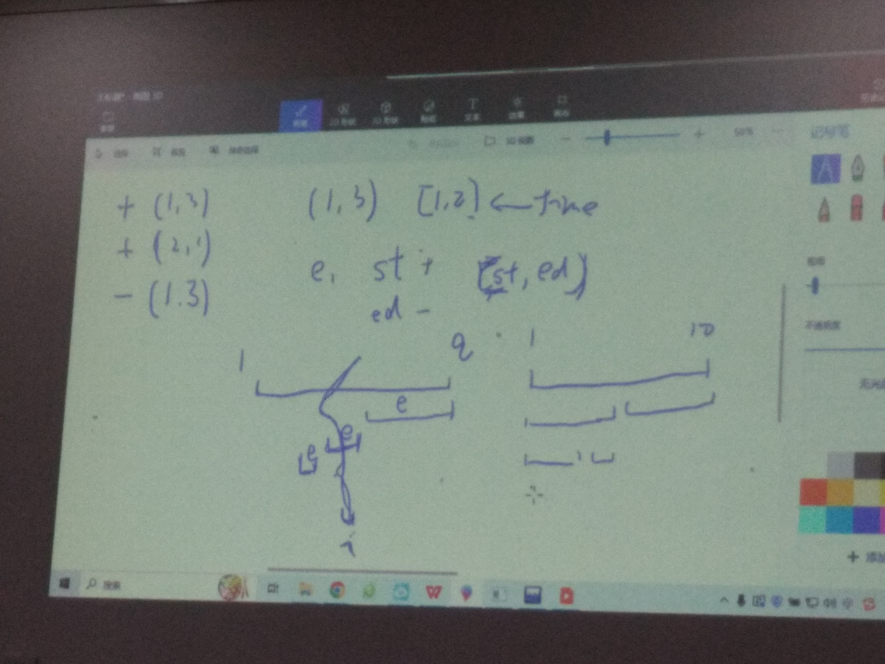

# 第三天
日常膜拜不放图片了  
**小提示：**
- 因为时间太紧，笔寄中的题目描述可能不全或有错误，请以PPT中的题目为准。
- 题解中 _斜体部分_ 是使用GitHub Copilot生成的，可能有些错误，仅供参考。

小发现：机房里还有一位大佬也反着穿衣服耶（

## 上午

### 一、图论
#### 加权路径和
> 给定一个$n$个点的树，每条边带权值$w_i$。有$q$次询问，每次询问点$u$到点$v$的路径的权值，一条路径的权值计算方法如下：  
假设路径上的边权是$w_1,w_2,...,w_k$，那么路径的权值为$w_1*1+w_2*2+...+w_k*k$。

> 版本一：强制在线：$n, q \leqslant 10^5$  
版本二：可以离线：$n, q \leqslant 10^6$  
版本三：强制在线，带修改（路径上所有边的权值都加上一个数）：$n, q \leqslant 10^5$

#### 次小生成树
> 给定一张$n$个点，$m$条边，每条边权值为$w_i$的无向图，求次小生成树权值和。  
$n, m \leqslant 10^5$

### 二、二叉堆
- 没啥好考的
- 左偏树应用会多一些

#### 参考资料
- [OI-Wiki 数据结构 / 堆 / 二叉堆](https://oi-wiki.org/ds/binary-heap/)
- [Wikipedia 维基百科](https://zh.wikipedia.org/zh-hans/%E4%BA%8C%E5%8F%89%E5%A0%86)

#### 例题：优先队列
- 题目描述：  
    > 老师现场出的，没记下题目来，自己去ppt里面找补
- 图解：  
    

#### 矩形叠加问题
- 题目描述：  
    > 给定一个$n \times n$二维平面上$m$个矩形，对于$i=1, 2, ..., n$，求所有满足$x=i$的整点中被最多矩形覆盖的整点被多少个矩形覆盖。
- 提示：  
    把二维中的$x$看作时间，$y$看作一个一维序列$a_1, a_2, ..., a_n$

    一个扫描线，从左到右扫过去，看与多少个矩形有交。与一个新矩形相交时$[yl, yr]+1$，离开矩形时$[yl, yr]-1$，_最后统计一下每个点被覆盖了多少次。_

#### [LibreOJ Round #6 花火](https://contest-archive.loj.ac/contest/11/problem/3/)
图解：  


### 三、线段树分治
#### 连通块个数
- 题目描述：  
    > 维护一张无向图$q$次操作，每次加入一条边或删一条边，求每次操作后的连通块个数。  
    $q \leqslant 1e5$
- 图解：  
    例一：  
    例二：

### 四、哈希 Hash
#### 哈希 & 字符串哈希
  
_我记得我应该是会哈希的，为什么给我讲蒙了（_

#### 经典应用
> 给定串$S, q$次询问，每次询问两个位置$l_1, l_2$的最长公共前缀。

#### [CF 1017 E](https://www.luogu.com.cn/problem/CF1017E)
> 给定两个平面中的点集$S, T$，判断他们的凸包是否旋转、平移同构。  
$\vert S \vert, \vert T \vert \leqslant 1e5$, 坐标范围 $[0, 10^8]$

#### CCF 2023 D 括号
- 题目描述：  
    > 给定一个有$m$种括号的长度为$n$的括号序列，每种括号分为左右两种，有$q$次操作，每次操作有两种情况：  
        1、修改一个位置的括号类型（哪一种、左/右）  
        2、询问一个区间$[l, r]$内的括号序列是否合法，合法的定义如下：  
            - 空串是合法的括号序列  
            - 如果A和B都是合法的括号序列，那AB也是  
            - 如果A是合法的括号序列，那么(A)、)A(、[A]、]A[也是（在A左右加一种括号的左右括号）  
    $n, q \leqslant 10^5$

    > 屑老师说这是他昨天晚上现编的，原题不是括号，是消消乐类的东西
- 小提示：  
    - 线段树维护连乘

#### [UOJ 同构判定鸭](https://uoj.ac/problem/552)
图解：  


线性代数...是什么？我连矩阵都没学啊啊啊啊  
还有特征多项式...

### 五、未讲内容
维护队列 / KMP / AC自动机

## 下午
换老师了，重新膜拜一下  

  

小剧透：今天下午全是DP

### 一、动态规划 之 树形DP
[树上两两距离和](images/IMG_20231001_140844.jpg):
- 求$\sum\sum dis(i, j)$
- 统计每条边的贡献：$size[a] \times (n - size[a])$

[求每个子树的深度与每个子树的大小](images/IMG_20231001_140755.jpg)：
- $depth[a] = max(depth[b] + 1)$
- $size[a] = 1 + \sum size[b]$

#### [Luogu P3047 \[USACO12FEB\] Nearby Cows G](https://www.luogu.com.cn/problem/P3047)

#### [Luogu P2014 选课](https://www.luogu.com.cn/problem/P2014)

#### [Luogu P3174 毛毛虫](https://www.luogu.com.cn/problem/P3174)

### 二、最大独立集 / 最小点覆盖
- 最大独立集：选尽可能多的点，父亲和儿子不能同时在集合里  
    $f_新[x][0] = f_老[x][0] + max{f[y][0], f[y][1]} \\
    f_新[x][1] = f_老[x][0] + f[y][0]$

- 最小点覆盖：选尽可能小的点，父亲和儿子必须有一个在集合里

#### [Luogu P2899 Cell Phone Nerwork G](https://www.luogu.com.cn/problem/P2899)

### 三、树上拓扑序计数
#### 例题
- 题目描述：  
    > 给定一颗外向树（每条边的方向是从父亲到儿子）， 求其拓扑序个数$mod 998244353$。  
    $n \leqslant 10^5$
- `GitHub Copilot`:
    我们可以使用动态规划来解决这个问题。设 $f_i$ 表示以节点 $i$ 为根的子树中，节点的拓扑序列个数。则有以下状态转移方程：

    $$f_i = \prod_{j \in son_i} f_j$$

    其中，$son_i$ 表示节点 $i$ 的所有儿子节点。这个方程的意义是，节点 $i$ 的拓扑序列个数等于其所有儿子节点的拓扑序列个数的乘积。

    最终的答案是以每个节点为根的子树的拓扑序列个数之和，即：

    $$ans = \sum_{i=1}^n f_i$$

    时间复杂度为 $O(n)$。

    以下是C++代码实现：
    ```C++
    #include <iostream>
    #include <vector>
    using namespace std;

    const int MOD = 998244353;

    vector<int> g[100005];
    int f[100005];

    void dfs(int u) {
        f[u] = 1;
        for (int v : g[u]) {
            dfs(v);
            f[u] = (long long)f[u] * f[v] % MOD;
        }
    }

    int main() {
        int n;
        cin >> n;

        for (int i = 2; i <= n; i++) {
            int p;
            cin >> p;
            g[p].push_back(i);
        }

        dfs(1);

        int ans = 0;
        for (int i = 1; i <= n; i++) {
            ans = (ans + f[i]) % MOD;
        }

        cout << ans << endl;

        return 0;
    }
    ```

### 四、树上问题
- 题目描述：  
    > 在树上选出$m$条边互不相交的链，使得它们的长度和最大。  
    $n \leqslant 10^5, m \leqslant 10$
    - `链`：在树上，`链`通常指一条从根节点到叶子节点的路径。
    - `半链`：在树上，`半链`通常指一条从根节点到非叶子节点的路径。
- `GitHub Copilot`：  
    这是一道经典的树形DP问题，可以使用DP来解决。

    我们设 $f_{i,j}$ 表示以节点 $i$ 为根的子树中，选出 $j$ 条互不相交的链的最大长度和。对于节点 $i$，我们可以考虑选或不选它的子树中的某些链，来构成 $j$ 条互不相交的链。如果选了节点 $i$ 的某个子节点 $v$ 的子树中的某条链，那么节点 $i$ 就不能选它的子节点 $v$。如果不选节点 $i$ 的某个子节点 $v$ 的子树中的某条链，那么节点 $i$ 就可以选它的子节点 $v$。

    因此，我们可以得到以下状态转移方程：

    $$f_{i,j} = \max{f_{i,j}, f_{i-1,j-k} + \sum_{v \in son_i} f_{v,k}}$$

    其中，$son_i$ 表示节点 $i$ 的所有儿子节点，$k$ 的取值范围为 $[0, j-1]$。这个方程的意义是，节点 $i$ 的子树中选出 $j$ 条互不相交的链的最大长度和，可以由以下两种情况转移而来：

    不选节点 $i$，则 $f_{i,j}$ 不变，即 $f_{i,j} = f_{i-1,j}$。

    选节点 $i$，则需要从节点 $i$ 的所有儿子节点中选出若干条互不相交的链，使得它们的长度和最大。因此，我们可以枚举节点 $i$ 的所有儿子节点 $v$，以及选出的链的数量 $k$，然后计算 $f_{i-1,j-k}$ 和 $\sum_{v \in son_i} f_{v,k}$ 的和，即可得到 $f_{i,j}$ 的值。

    最终的答案是 $f_{n,m}$，其中 $n$ 表示树的根节点。

    时间复杂度为 $O(nm^2)$。

    以下是C++代码实现：
    ```C++
    #include <iostream>
    #include <vector>
    #include <cstring>
    using namespace std;

    vector<int> g[100005];
    int f[100005][105];

    void dfs(int u, int m) {
        for (int i = 0; i <= m; i++) {
            f[u][i] = 0;
        }
        f[u][0] = 0;

        for (int v : g[u]) {
            dfs(v, m);
            for (int j = m; j >= 1; j--) {
                for (int k = 0; k <= j-1; k++) {
                    f[u][j] = max(f[u][j], f[u][j-k-1] + f[v][k]);
                }
            }
        }
    }

    int main() {
        int n, m;
        cin >> n >> m;

        for (int i = 2; i <= n; i++) {
            int p;
            cin >> p;
            g[p].push_back(i);
        }

        dfs(1, m);

        cout << f[1][m] << endl;

        return 0;
    }
    ```
- `GitHub Copilot`举的例子：  
    假设我们有以下一棵树：
    ```
        1
       / \
      2   3
     / \   \
    4   5   6
    ```

    我们需要选出 $m=2$ 条互不相交的链，使得它们的长度和最大。我们可以使用树形DP来解决这个问题。

    首先，我们需要定义状态 $f_{i,j}$，表示以节点 $i$ 为根的子树中，选出 $j$ 条互不相交的链的最大长度和。对于这棵树，我们可以得到以下状态：

    其中，$f[1][0]$ 表示以节点 $1$ 为根的子树中，选出 $0$ 条互不相交的链的最大长度和，显然为 $0$。$f[1][1]$ 表示以节点 $1$ 为根的子树中，选出 $1$ 条互不相交的链的最大长度和，可以选取链 $(1,3)$ 或 $(2,5)$，长度和为 $6$。$f[1][2]$ 表示以节点 $1$ 为根的子树中，选出 $2$ 条互不相交的链的最大长度和，可以选取链 $(1,3)$ 和 $(2,5)$，长度和为 $10$。

    接下来，我们需要考虑状态转移方程。对于节点 $i$，我们可以考虑选或不选它的子树中的某些链，来构成 $j$ 条互不相交的链。如果选了节点 $i$ 的某个子节点 $v$ 的子树中的某条链，那么节点 $i$ 就不能选它的子节点 $v$。如果不选节点 $i$ 的某个子节点 $v$ 的子树中的某条链，那么节点 $i$ 就可以选它的子节点 $v$。

    因此，我们可以得到以下状态转移方程：

    $$f_{i,j} = \max{f_{i,j}, f_{i-1,j-k} + \sum_{v \in son_i} f_{v,k}}$$

    其中，$son_i$ 表示节点 $i$ 的所有儿子节点，$k$ 的取值范围为 $[0, j-1]$。这个方程的意义是，节点 $i$ 的子树中选出 $j$ 条互不相交的链的最大长度和，可以由以下两种情况转移而来：

    - 不选节点 $i$，则 $f_{i,j}$ 不变，即 $f_{i,j} = f_{i-1,j}$。

    - 选节点 $i$，则需要从节点 $i$ 的所有儿子节点中选出若干条互不相交的链，使得它们的长度和最大。因此，我们可以枚举节点 $i$ 的所有儿子节点 $v$，以及选出的链的数量 $k$，然后计算 $f_{i-1,j-k}$ 和 $\sum_{v \in son_i} f_{v,k}$ 的和，即可得到 $f_{i,j}$ 的值。

    最终的答案是 $f_{1,2}$，即以根节点 $1$ 为根的子树中，选出 $2$ 条互不相交的链的最大长度和，为 $10$。

    希望这个例子可以帮助你理解这个问题！


### 五、状态压缩
#### [Luogu P1171 售货员的难题](https://www.luogu.com.cn/problem/P1171)
设$f[S][i]$表示从$1 \rightarrow i$ .....

#### [Luogu P1559 运动员最佳匹配问题](https://www.luogu.com.cn/problem/P1559)

#### [Luogu P1896 互不侵犯](https://www.luogu.com.cn/problem/P1896)

#### [Luogu P2704 炮兵阵地](https://www.luogu.com.cn/problem/P2704)

#### [Luogu P2157 学校食堂](https://www.luogu.com.cn/problem/P2157)

#### [Luogu P3226 集合选数](https://www.luogu.com.cn/problem/P3226)

#### [Luogu P3147 262144 P](https://www.luogu.com.cn/problem/P3147) ?

## 晚上
